## ARC60 Data Analysis Notebook
This repository contains the notebook I made during my 2026 mitacs summer internship at Dr. Paul Myer's lab in the University of Alberta and the figures it created. It is able to process and plot data from NEMO's ARC60 configuration output, Copernicus satellite data and other specific paper's data files as Von Appen et al. 2022 mooring EKE observations and Cole 2026 ITP tracks' spatial data. It is organized into 4 main cells containing:

1. Setup Cell
2. Shared Helper Functions
3. Processed Data Generating Functions
4. Graphing Functions

The main workflow involves running functions defined in Cell 3 that save processed data (mainly .npz files) in the processedData/ folder before running functions from cell 4 that read the processed data and generate graphs (.png files) stored in the figures/ folder. All the graphs and the 3MT slide created for this project are also available in the canva presentation https://canva.link/lmy1dwuagmi28ns

To access the notebook you should tunnel into sumeria

`ssh -L  8080:localhost:8080 [your username]`

And then go to the project directory, source conda, and activate andres_env which has all the packages and libraries installed to run the notebook, finally list the running jupyter notebook by running
```
cd /mnt/storage5/andres
source /mnt/storage6/anaconda/bin/activate
conda activate /mnt/storage5/andres/anaconda/envs/andres_env
jupyter server list
```
Ctrl+Click on the server link to open the Jupyter tab on your browser and go to the codes/ folder where you will find the notebook.

Above each of the 4 main cells there is a detailed list of its contents and every function in the notebook has a little explanatory text below its definition. For a more direct understanding on how everything runs I will paste here the Usage Examples section of the notebook.

## Usage Examples

### Speed and EKE Spatial Plots

To generate any of those plots you first need to call `speedField()` and `ekeField()` respectively
They receive the folowing arguments: 
* `timePeriod`: can be an int for a yearly average as in `1994`, or a string for a season as in `'JFM'`
* `depth`: receives either `0`, `50`, `100` or `200`
* `integrated`: when `True` calculates the vertical depth weighted average between the 0-50 if `detph=50`, between 50-100 if `detph=100`, and between 100-200 if `depth=200`, the resulting .npz will have a `'_int'` suffix in its name. When `False` it produces a single depth field at the `depth` value given.
* `cropped`: when `True` the Field extends over the *Bounding Box* area defined by lat:[65,85] and lon:[-110,-180]. When `False` it extends over the whole ARC60 simulation domain adding a `'full_'` prefix to the file name.
* `timeseries`: when `False` the function simply produces the corresponding spatial field, when `True` it calculates the mean dayly values over the *Canadian Basin Mask* (given by Clark) between the specific depth range defined by the `detph` value and `integrated=True`. It only works for yearly `timePeriod` as the timeseries graph function simply joins all timeseries data file ending with a `'_timeseries'` suffix in its name.

All the Spatial Plots figures are generated with graphFunction(), which simply receives the .npz file name string as an argument, here are some examples of its usage plotted every 4 points `'step=4'` which is a good enough resolution, but when testing I recommend passing `'step=32'`. Also, when saving any figure from any graph function you need to pass `'save=True'` as by default graphs are only shown inside the notebook, and if you are generating many figures it may be convenient to set `show=False` inside that loop call so that figures are only saved and not shown.
```
speedField(1994, depth=0, integrated=False, cropped=True) # 1994 yearly avg at the surface (0 m) in the Bounding Box
graphFunction('speed_1994_0', show_mask=True, step=4) # show_mask shows the Canadian Basin Mask contour in the map
```
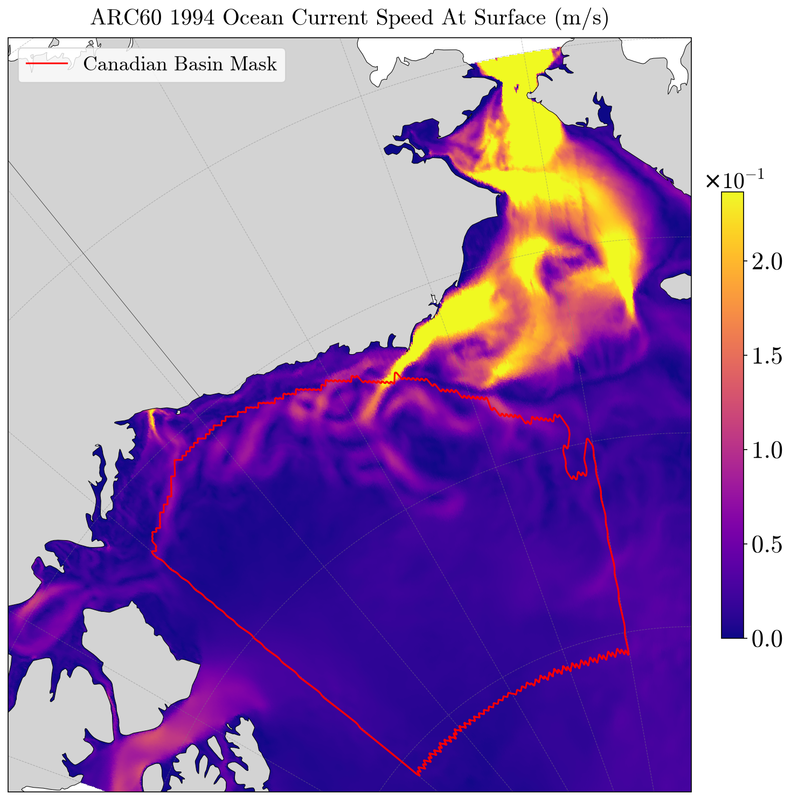

### FWT Spatial Fields and Timeseries Plots

the `fwtField()` receives the same arguments as `speedField()` and `ekeField()` except for `depth` and `integrated` as it is simply a 2D variable. The timeseries generated is simply the average over the canadian basin for each day of the year and could be generated with:

```
for year in range(YEAR_START, YEAR_END + 1): # if we want to extend any of the analysis to 2000 or 2001 we must  
    fwtField(year, timeseries=True)          # simply change YEAR_END=2000 or YEAR_END=2001 in cell 1
graphTimeseriesMultiyear('fwt348', show_mean=True, show_monthly=True, show_annual_means=True) 
#show_mean: red line, show_monthly: blue line, show_annual_means: black lines
```
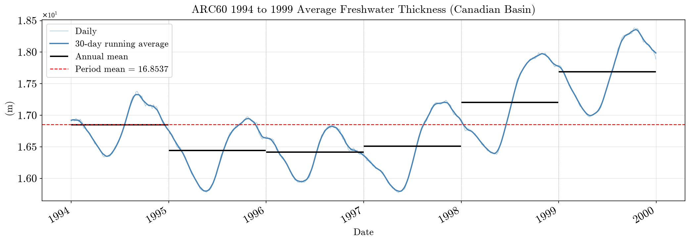

### Vertical Profiles

The vertical profiles are generated simply by calling `speedVerticalProfile(timePeriod)` or `ekeVerticalProfile(timePeriod)` and passing the corresponding timeperiod which can be either a season string as in `'OND'` or a year int as `1995`. They are then graphed with graphVerticalProfile() that only receives the file name string. For example:

```
speedVerticalProfile('OND')
graphVerticalProfile('vprofile_speed_OND')
```
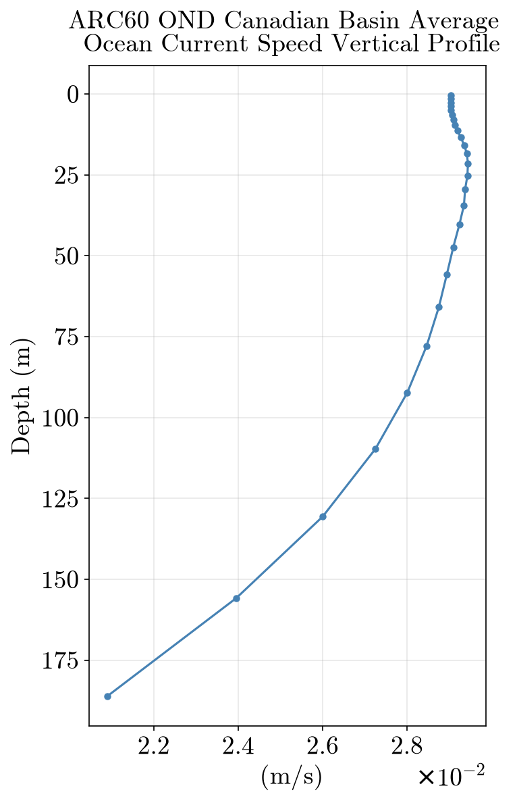

### Satellite Data Spatial Fields

The Satellite data was downloaded from https://data.marine.copernicus.eu/product/SEALEVEL_GLO_PHY_L4_MY_008_047/services

Satellite Geostrophic Speed and Sea Level Anomaly Standard Deviation fields can be generated with `satSpeedField()` and `satSLAStd()` they receive:
* `timePeriod`: which can generate yearly, seasonal and now monthly time averages passed as strings as in `'Jan'` or `'Aug'`
* `mask_ice`: when `False` does nothing, when `True` generates an additional .npz file with an `'_icemask'` suffix that stores the points that where always ice covered during the correponding time period passed.
* `cropped`: works the same as in the speed, eke and fwt fields.

Here is some example of how to graph this data with `graphSatField()`

```
satSLAStd('Jul', mask_ice=True) # Jul average Satellite SLA Standard Deviation, with ice_maks generated
graphSatField('sat_sla_std_Jul', show_ice=True) # show_ice=True shows the always ice covered region
```
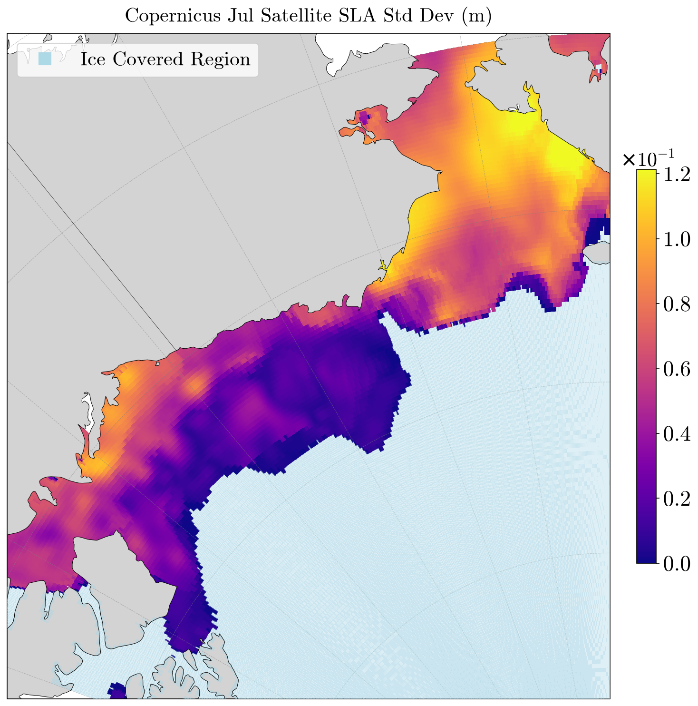

### Model Geostrophic Speed and Model-Sat Graph Comparisons

Model Geostrophic Speed Spatial Fields can be generated by calling `modelGeoSpeedField(timePeriod, ice_threshold=0.15, smooth_ssh=False, smooth_km=10, mask_ice=False, cropped=True)` 

The `timePeriod` works exactly as for the Satellite data receiving years, seasons and months. The same for`cropped` and `mask_ice` variables, which generates an icemask .npz for pixels with over 15% ice concentration (`ice_threshold=0.15`) over the whole period. When `smooth_ssh=True` it smooths the final geostrophic speed field over 10 km windows (`smooth_km=10`) and adds a `'_smooth10km'` suffix to the file name. Here's an example:

```
modelGeoSpeedField(1994, smooth_ssh=True, smooth_km=10) # model geostrophic smoothed over 10km window averages
graphFunction('model_geo_speed_1994_smooth10km')
```
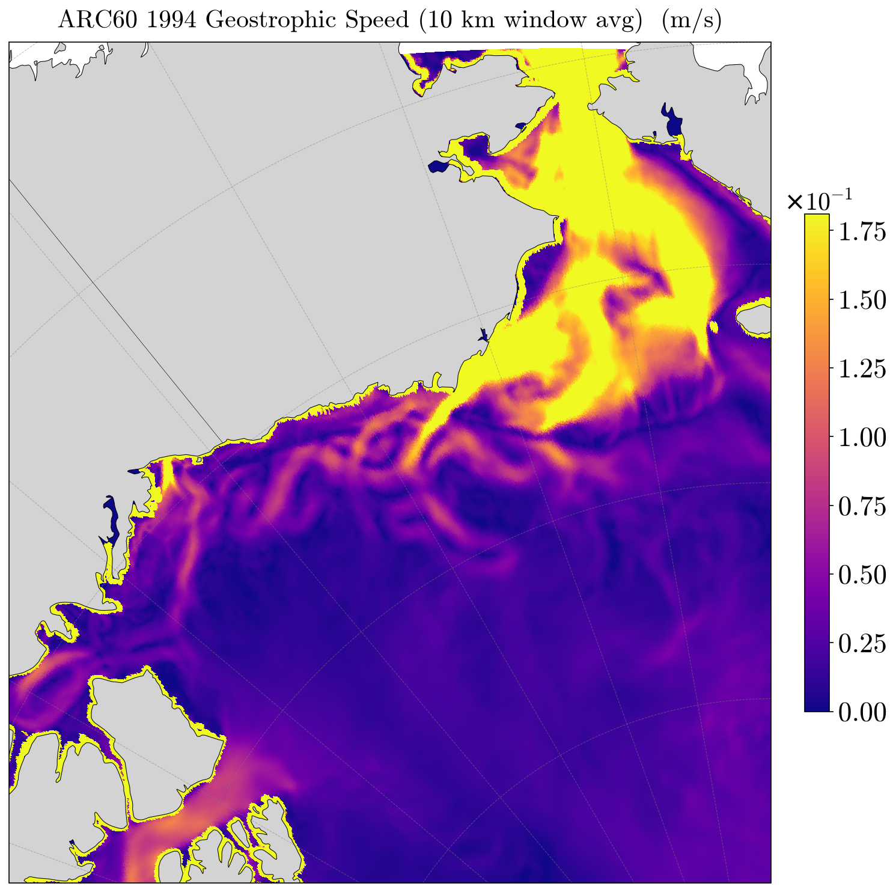
To compare directly the model and the satellite geospeed fields use `graphComparison(model_file, sat_file, show_bathy=True)` which receives the names of the corresponding model and satellite .npz files and matches the minimum and maximum value in the color bar of each map and adds a `'_comparison'` suffix to the figure name. Here the `show_bathy` variable masks the regions where the ocean depth is < 100 m when True in both `graphFunction()` and `graphSatField()`. Here is a usage example:
```
graphComparison('model_geo_speed_1999','sat_speed_1999', show_bathy=True, show=True, save=False) # show_bathy masks <100 m depth regions
```
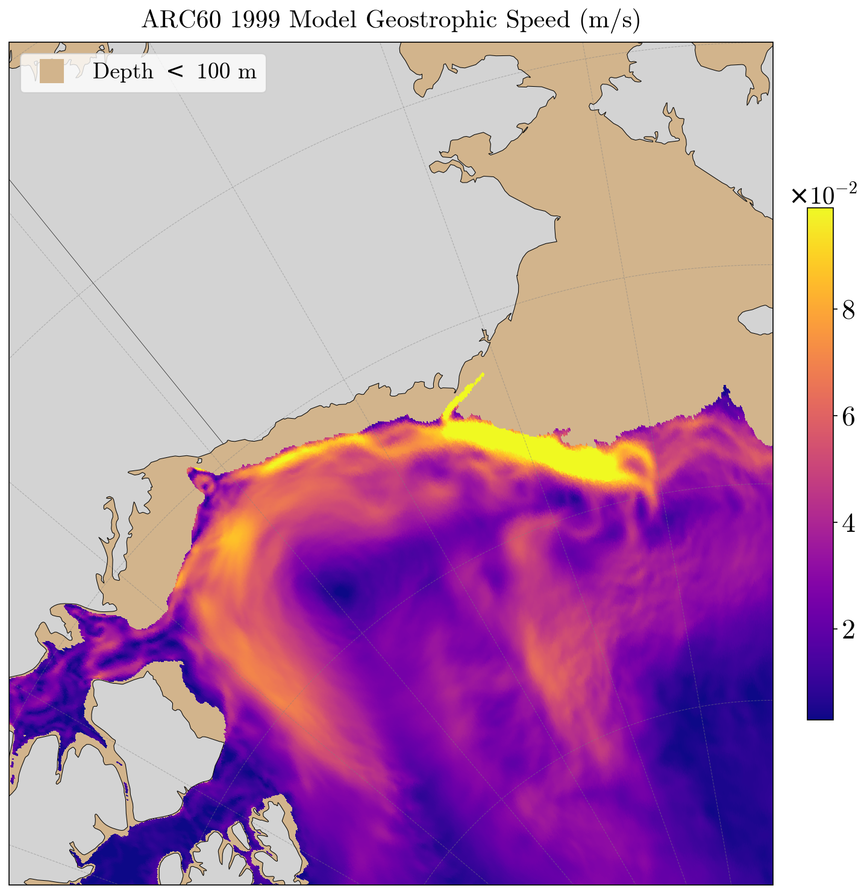 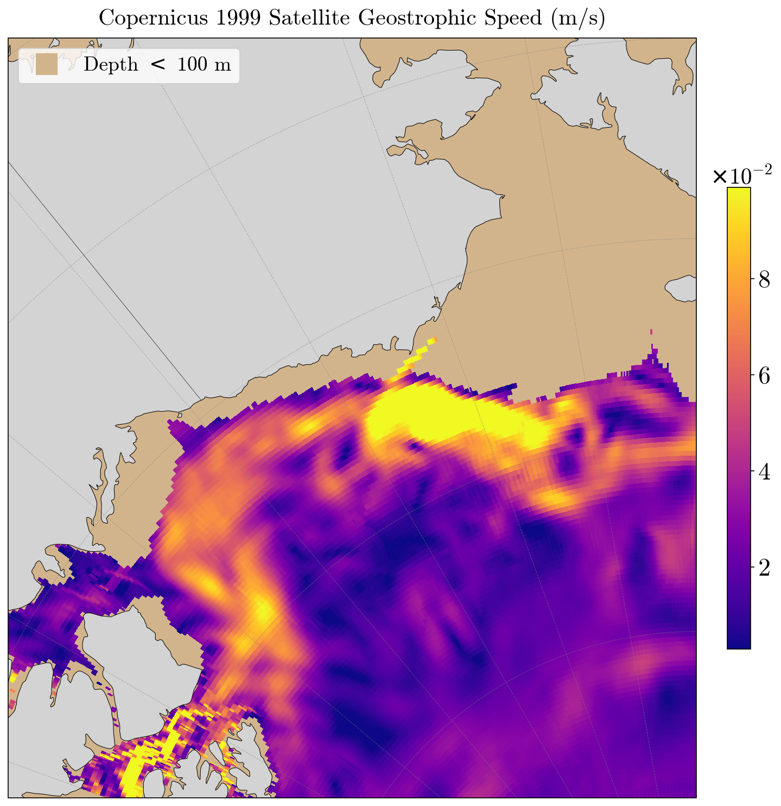

### SSH Standard Deviation and Anomaly Fields

Sea Surface Height Standard Deviation fields can be generated by calling `modelSSHStd(timePeriod, ice_threshold=0.15, cropped=True, mask_ice=False)` and Anomaly Fields with `sshAnomalyField(timePeriod, cropped=True)` all parameters work exactly as explained in the functions before, generating yearly, seasonal and monthly fields. 

For SSH Anomaly fields the mean is calculated exclusively over points where the sea depth is lower than 100 m in the Bounding Box area (`cropped=True`) or in the whole ARC60 domain (`cropped=False`). And as it produces both negative and positive points it is useful to pass `cmap='coolwarm'` to `graphFunction()` that automatically sets the white color to the 0 values when that colormap is given, as shown here:

```
sshAnomalyField('Aug')
graphFunction('ssh_anom_Aug', cmap='coolwarm', show_bathy=True) # use cmap='coolwarm' for positive and negative data 
```
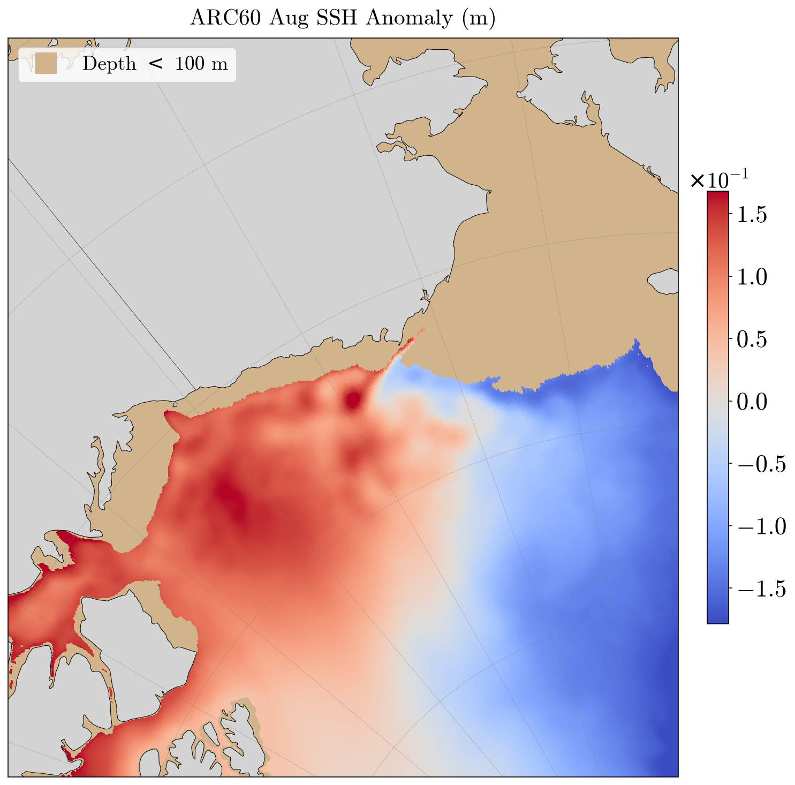

### First Cole Comparison (Window Averages)

The comparisons with Cole's work where focused on replicating Fig.5 and Fig.7 of that paper. Those figures show measurements done in the canadian basin region of the contribution of different spatial scales to the kinetic energy at different depth levels. To emulate them with the simulation data window averages were done for each point in the *Canadian Basin Mask* (shown in the first figure of the Example Usage section) varying the window lenght over the spatial scales reported in the paper (7, 30, 60, 120 and 240 km) for each depth level until 200 m depth. The function `sovProfiles(timePeriod)` does that for each day and averages over the time period given (year, season or month) saving also the temporal std dev for each point.

After the data is generated simply call graphSOVBandProfiles(timePeriod=None, speed=False) to generate a Fig.5 like figure for the `timePeriod` given, if no `timePeriod` argument is passed to the function it replicates the seasonal averages of the paper separating the Oct-Jun and the Jul-Sep periods. Also if `speed=True` the function shows the speed profiles intead of the KE profiles. It's usage is shown here:

```
graphSOVBandProfiles(1999)
graphSOVBandProfiles(speed=True)
```

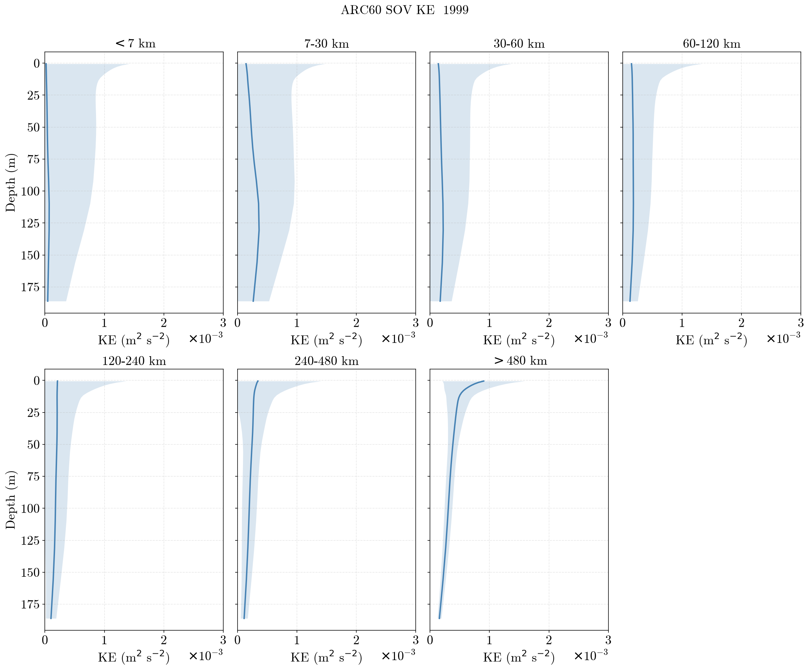 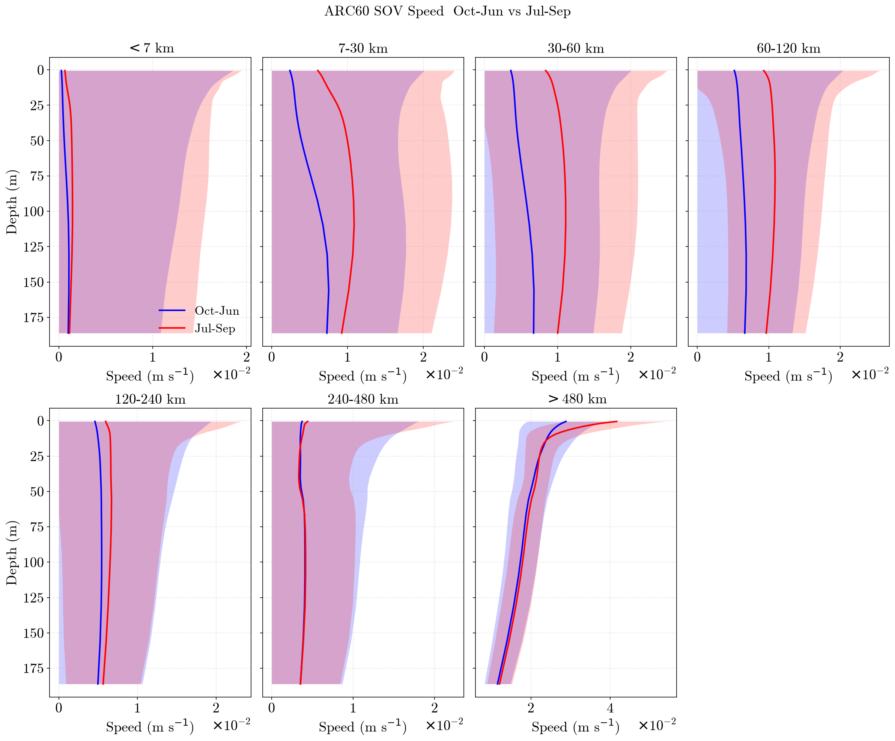

Now to generate Fig.7 like figures run `graphSOVFullPanel(timePeriod, speed=False)` which arguments work in the same way as in the previous function. Here's an example.

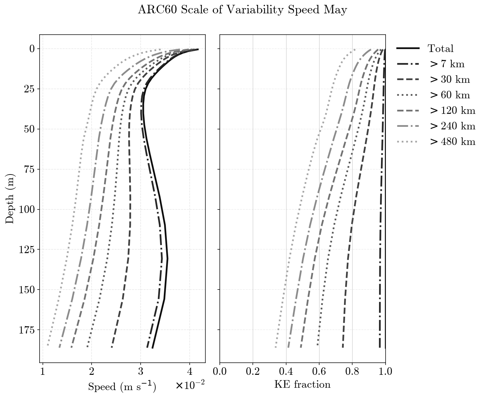 

### Second Cole Comparison (ITP Tracks)

For this comparison I used the Ice Tethered Profilers' spatial track data (ITP) used by Cole from https://www2.whoi.edu/site/itp/data 
I saved the .dat file with hourly buoy location data for each of the ITPs mentioned in the paper in .txt files inside the processedData/itp_transects/ folder. With those files there I then ran `buildITPTransect()` for each ITP to store a file that has the positions of the files cut only to the dates mentioned in Table 1 of Cole's paper and that can be graphed via `graphITPTracks()`

```
for num in [70, 77, 78, 79, 80, 113, 114]:
     buildITPTransect(num)
graphITPTracks((70, 77, 78, 79, 80, 113, 114), show_mask=True)
```
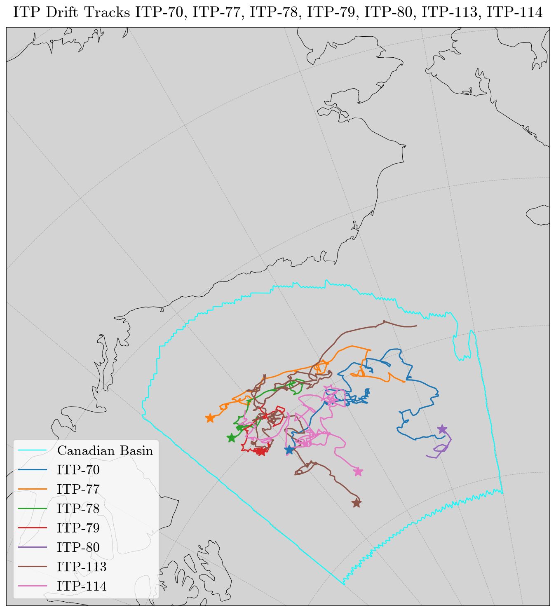

After having those transect files I extracted the U and V data for each day in 1998 and 1999 years (as those are the ones where the Beaufort Gyre starts to be discernible in the model) with `extractTransectModelUV()` and then applied a fourth order butterworth low pass filter for each spatial scale to calculate its contribution with `computeTransectKEProfiles()` as done in the paper. After all the files where generated I finally ran `averageITPKEProfiles()` to generate a single .npz file with the total, Oct-Jul and Jun-Sep averages, I then deleted all intermediate data files. The comparison figure can be generated with `graphITPKEAvgProfiles()`. The following cell shows how this was all implemented:

```
# the following section is commented to stop it from generating all the intemediate data files again:
"""
for num in [70, 77, 78, 79, 80, 113, 114]:
     for date in common_dates:
         if date.year == (1998 or 1999):
             try:
                 extractTransectModelUV(num, f'y{date.year:04d}m{date.month:02d}d{date.day:02d}')
                 computeTransectKEProfiles(num, f'y{date.year:04d}m{date.month:02d}d{date.day:02d}')
             except Exception as e:
                 print(f"  Failed ITP-{num} {date}: {e}")
averageITPKEProfiles()
"""
graphITPKEAvgProfiles()
```
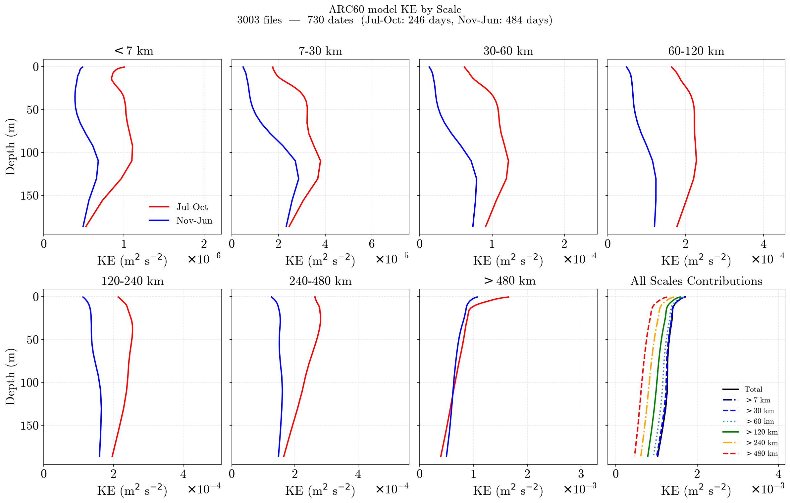

### Von Appen Comparison

The moorings data used to create the Von Appen Fig.3 like figure is available a https://doi.pangaea.de/10.1594/PANGAEA.941165 

The function `graphVonAppenComparison(model_eke_file, depth_min=0, depth_max=200, year_start=None, year_end=None, season=None, full=False)`
takes any previously generated eke .npz file, graphs it as `graphFunction()` would and overlays moorings at depths between `depth_min` and `depth_max` variables and between `year_start` and `year_end`, which when `None` selects all available mooring at the specified depths in the whole dataset. The variable `season` is also useful if one only wants to select moorings over a specific season like `'JAS'` over the whole dataset.

For the last comparison I also generated a depth wheighted mean eke field from 0-200 m depth over 1998 and 1999 years from previously generated fields with `depthWeightedMeanEKE()` function, which was useful for this specific purpose but could be generalized further.

```
depthWeightedMeanEKE(
 file_groups=[
         {50: 'full_eke_1998_50_int',
          100: 'full_eke_1998_100_int',
          200: 'full_eke_1998_200_int'},
         {50: 'full_eke_1999_50_int',
          100: 'full_eke_1999_100_int',
          200: 'full_eke_1999_200_int'},
     ],
     out_name='full_eke_1998_1999_dw_mean_0_200',
 )
graphVonAppenComparison('full_eke_1998_1999_dw_mean_0_200', depth_min=0, depth_max=200, full=True)
```

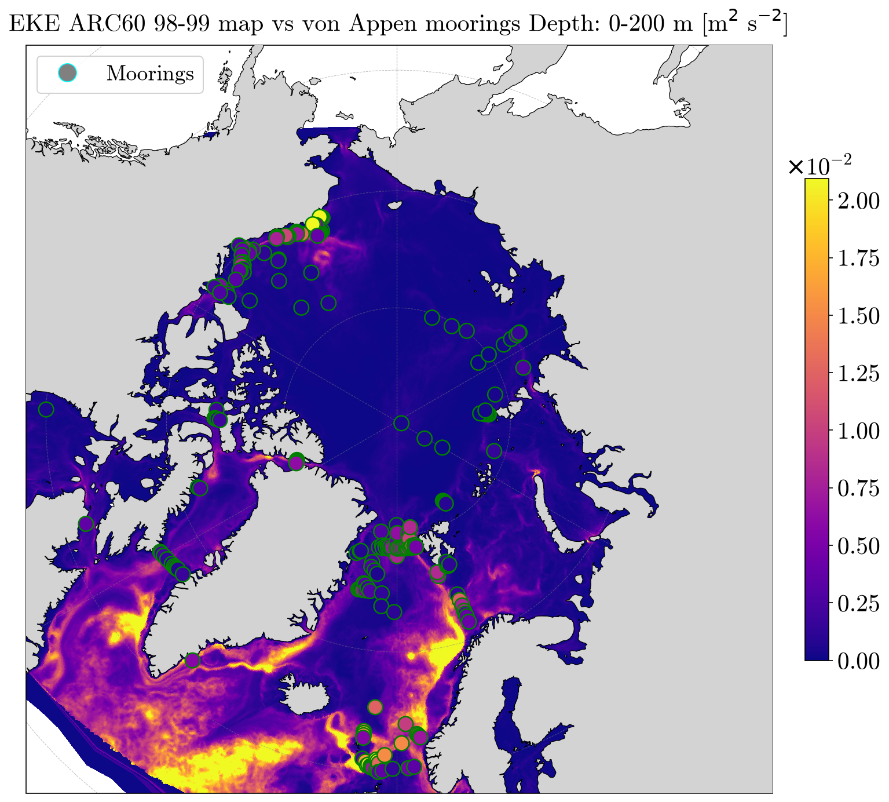

### Bering Strait Volume Transport SSH and SSH Anomaly Correlation

I first extracted the dates and volume transport between `year_start` and `year_end` using `loadBeringTransport()`. Then I pass them as arguments to the `beringSSHCorrelation()` function, which also rerceives `anom=True` to calculate the correlation with the SSH Anomaly field, and `anom=False` to calculate the correlation with the raw SSH field. I finally graph it `graphFunction()`

```
bering_dates, bering_vol = loadBeringTransport(year_start=1994, year_end=1999)
beringSSHCorrelation(bering_dates, bering_vol, cropped=True, anom=True)
graphFunction('bering_ssh_anom_corr', cmap='coolwarm')
```

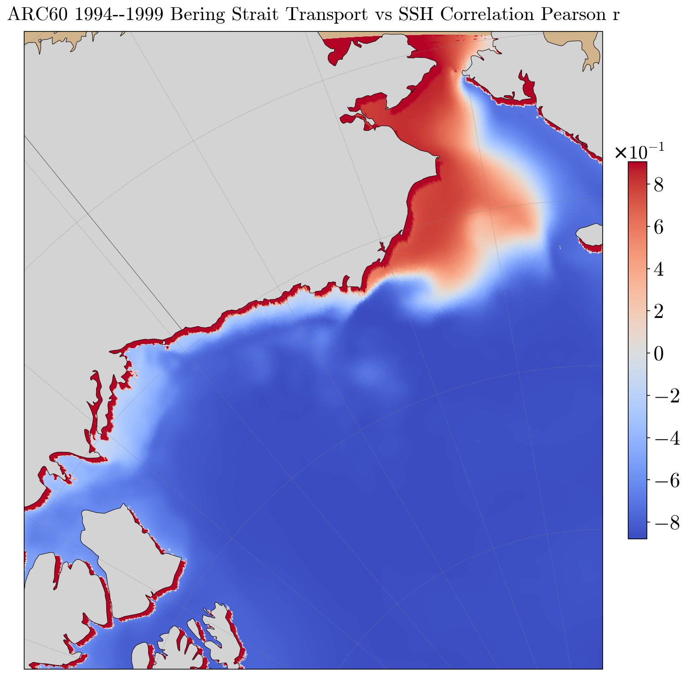
